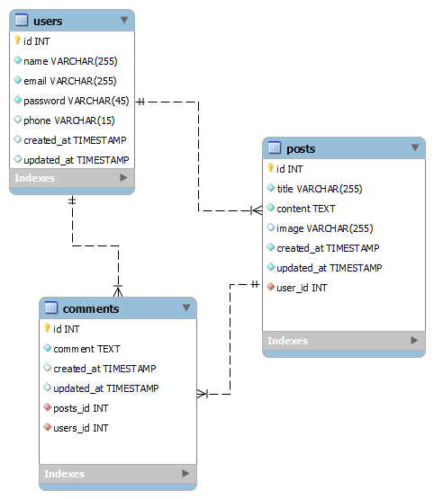
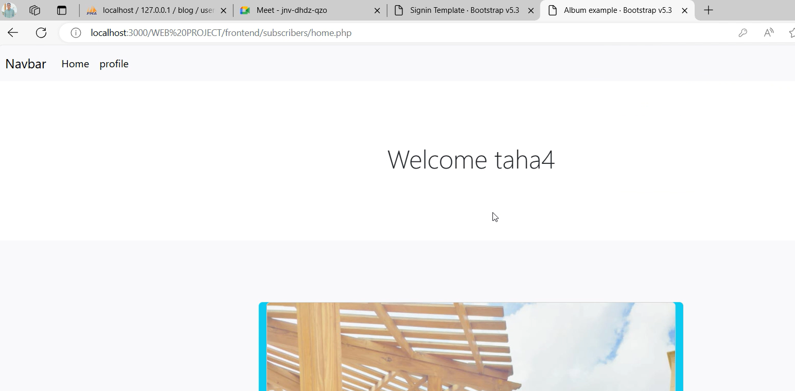
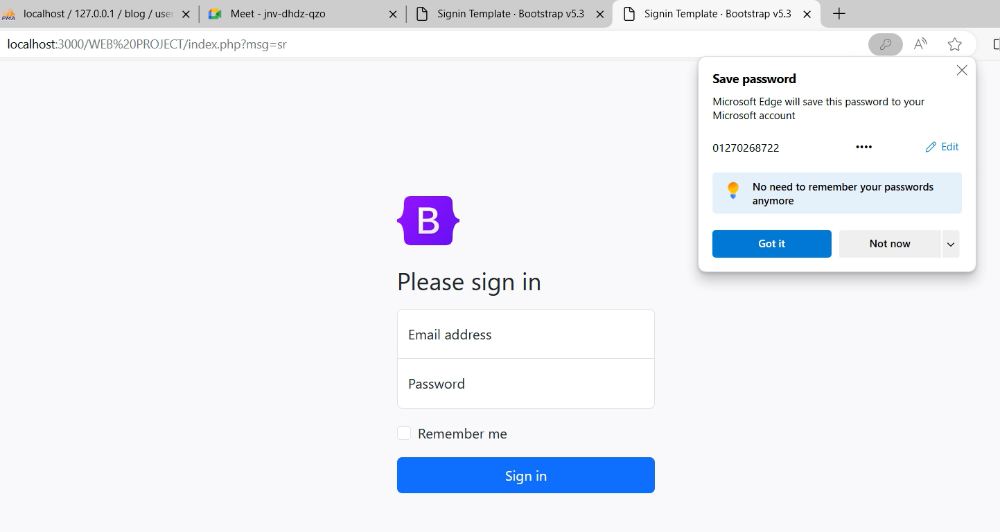
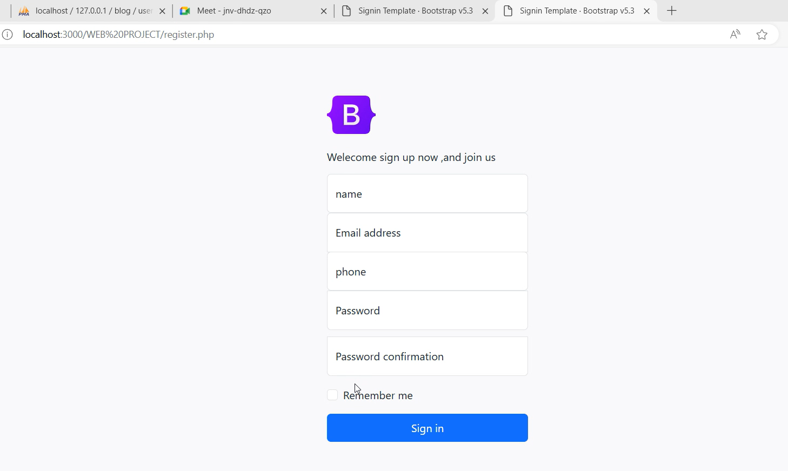
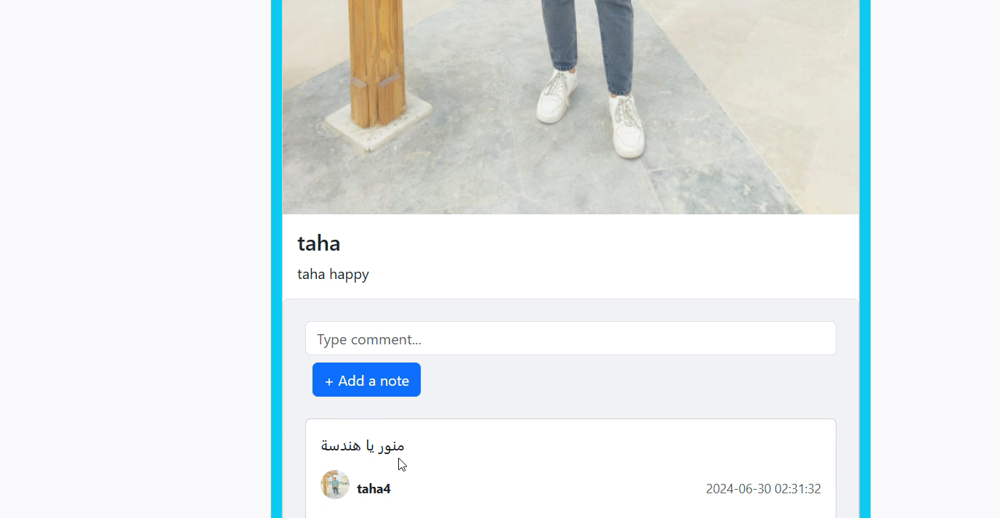
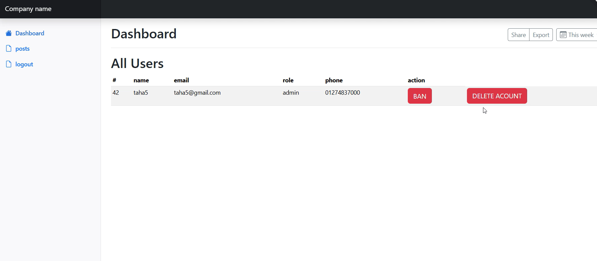
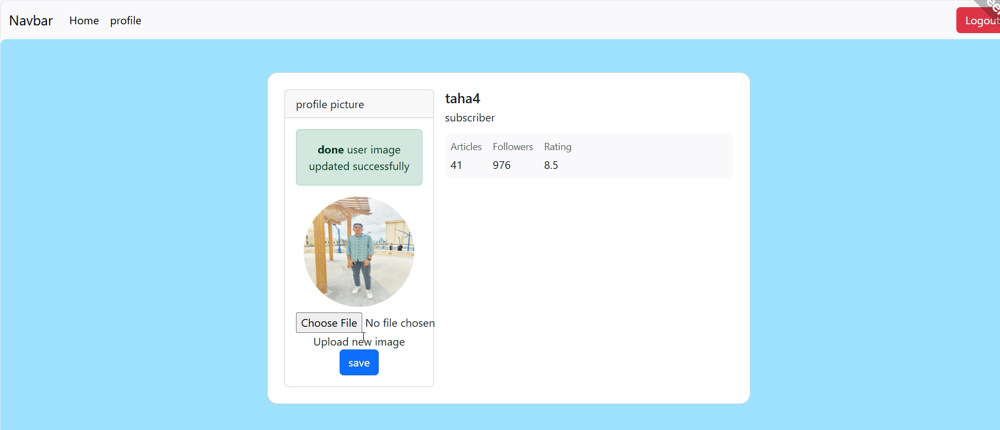
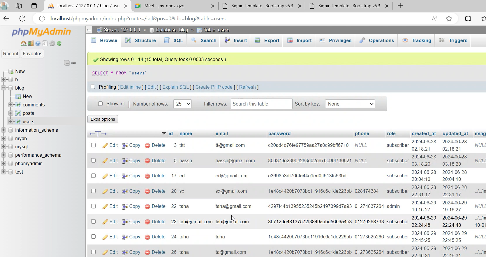

# 📝 Blog Management System


A complete Blog Management System developed using PHP, MySQL, HTML, CSS, and JavaScript.  
The system allows users to register, log in, create blog posts, manage their content, and interact through comments.

---

## 📌 Project Overview

This project was developed as part of my university coursework to demonstrate full-stack web development concepts, including:

- User Authentication
- CRUD Operations
- Database Design
- File Upload Handling
- User-Generated Content Management
- Relational Database Modeling

---

## 🚀 Features

### 👤 User Features
- User Registration
- User Login & Logout
- Profile Management

### 📝 Post Features
- Create New Posts
- Edit Existing Posts
- Delete Posts
- View All Posts
- Upload Post Images

### 💬 Comment Features
- Add Comments
- View Comments
- Link Comments to Users and Posts

### 🗄️ Database Features
- Relational Database Design
- Foreign Key Constraints
- Data Integrity

---

## 🛠️ Technologies Used

| Technology | Purpose |
|------------|----------|
| PHP | Backend Development |
| MySQL | Database |
| phpMyAdmin | Database Management |
| HTML5 | Structure |
| CSS3 | Styling |
| JavaScript | Client-side Functionality |

---

## 🏗️ Database Design (ERD)

### Entity Relationship Diagram

<p align="center">
  
</p>


---


## 📸 Project Screenshots

### Home Page



### Login Page



### Registration Page



### Post Details



### Admin



### Profile



---

### Database



---

## 🗂️ Database Tables

### Users Table

## 🗄️ Database Tables

| Users | Posts | Comments |
|--------|--------|----------|
| id | id | id |
| name | title | comment |
| email | content | posts_id |
| password | image | users_id |
| phone | user_id | created_at |
| created_at | created_at | updated_at |
| updated_at | updated_at | - |

---

## 🔗 Database Relationships

- One User can create multiple Posts.
- One User can create multiple Comments.
- One Post can contain multiple Comments.
- Each Comment belongs to one User and one Post.

---

## ⚙️ Installation Guide

### 1. Clone Repository

```bash
git clone https://github.com/TahaIsmal/Blog-System-PHP.git
```

### 2. Move Project Folder

Move the project into:

```text
xampp/htdocs/
```

### 3. Import Database

- Open phpMyAdmin
- Create a database
- Import the provided SQL file

### 4. Configure Database Connection

Update:

```php
config.php
```

with your database credentials.

### 5. Run Project

```text
http://localhost/Blog-System-PHP
```

---

## 📁 Project Structure

```text
Blog-System-PHP/
│
├── assets/
├── frontend/
├── image/
│
├── classes.php
├── config.php
├── handle_login.php
├── handle_register.php
├── handleLogout.php
├── index.php
├── register.php
│
├── database/
│   └── blog.sql
│
├── screenshots/
│   ├── ERD.png
│   ├── home.png
│   ├── register.png
│   └── login.png
│
└── README.md
```

---

## 👨‍💻 Author

**Taha Esmail**

GitHub: https://github.com/TahaIsmal

LinkedIn: https://www.linkedin.com/in/taha-esmail-61247229a

---

## ⭐ Future Improvements

- Search Functionality
- Categories and Tags
- Admin Dashboard
- User Roles
- Email Verification
- Password Recovery
- REST API Integration
